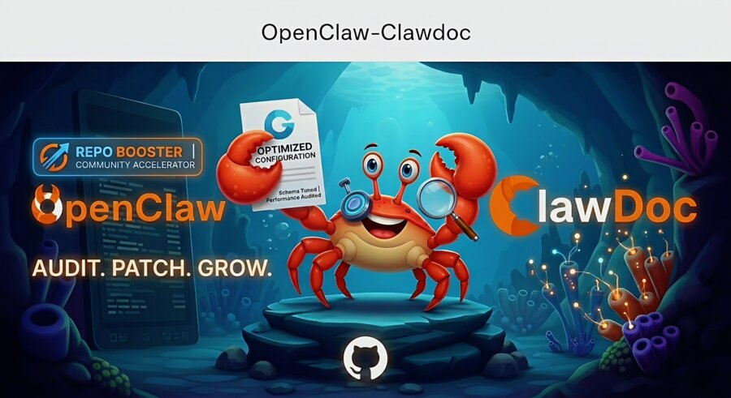

# ClawDoc

**The OpenClaw knowledge-base agent for config audits, troubleshooting, and grounded system fixes.**

[](https://github.com/openclaw/openclaw)
[](#skill-tree)
[](#reference-docs)
[](LICENSE)

<p align="center">
  
</p>

---

## What is ClawDoc?

ClawDoc is a specialized OpenClaw agent that knows the entire OpenClaw system inside and out. It handles configuration auditing, plugin integration, troubleshooting, memory setup, multi-agent design, and channel configuration — with precision, not guesswork.

> [!NOTE]
> ClawDoc is a community project. It is **not affiliated with or endorsed by** OpenClaw.

> [!TIP]
> Every answer is grounded in the actual OpenClaw schema and docs. Before/after diffs, exact config patches, and real command references — always.

---

## Who is this for?

ClawDoc is for OpenClaw operators who need reliable help with:
- setting up channels and providers
- debugging config and runtime issues
- adding memory, tools, plugins, and agents
- generating safe config patches instead of guessing

---

## Install

**AI-agent install (recommended):**

```
"Install ClawDoc from https://github.com/Hashi-Ai-Dev/openclaw-clawdoc"
```

Your agent reads the repo, picks up all 22 skills, and is ready to help. That's it.

**Manual install:**

```bash
git clone https://github.com/Hashi-Ai-Dev/openclaw-clawdoc.git
mkdir -p ~/.openclaw/skills
cp -r openclaw-clawdoc/skills/* ~/.openclaw/skills/
```

> Note: OpenClaw normally discovers individual skill directories from `~/.openclaw/skills/`. If your setup uses a different skills path, copy the contents of `skills/` into that configured directory.

**Need help getting started?** → [QUICKSTART.md](./QUICKSTART.md) (10 min)

---

## Use it

```
@your-agent [any OpenClaw config question]
```

ClawDoc routes to the right skill, reads the relevant docs, and gives you a precise, grounded answer.

---

## Reference docs

**506 docs** copied from the official OpenClaw source and versioned against the tracked OpenClaw release.

| Area | What's covered |
|------|---------------|
| Config | All gateway config keys, defaults, secrets, retry, failover |
| Memory | builtin / QMD / Honcho setup, embeddings, citations |
| Agents | Multi-agent, bindings, sandbox, tool policies |
| Channels | Discord, Telegram, WhatsApp, Slack, Signal, and 27 more |
| Concepts | Architecture, session, compaction, streaming, queue |
| Providers | 50+ model providers: OpenAI, Anthropic, Gemini, Bedrock, Ollama... |
| CLI | Every openclaw command with examples |
| Troubleshooting | Error codes, diagnostic flows, common fixes |

---

## Skill tree

### Core
| Skill | What it does |
|-------|-------------|
| `openclaw-master` | Top-level routing — maps your question to the right skill |
| `openclaw-config` | Gateway config reference — all keys, all patterns |
| `openclaw-memory` | Memory backends: builtin, QMD, Honcho |
| `openclaw-agents` | Multi-agent, bindings, sandbox, tool policies |
| `openclaw-channels` | 31 channel types: Discord, Telegram, WhatsApp, Slack... |

### Operations
| Skill | What it does |
|-------|-------------|
| `openclaw-troubleshooting` | Diagnosis flows, error codes, common fixes |
| `openclaw-automation` | Cron, hooks, tasks, Task Flow |
| `openclaw-logging` | Logging configuration and management |
| `openclaw-ci` | CI/CD integration, webhooks |

### Channels & Platforms
| Skill | What it does |
|-------|-------------|
| `openclaw-nodes` | Mobile/desktop node pairing and device management |
| `openclaw-platforms` | Docker, Railway, Fly, Raspberry Pi, DigitalOcean... |
| `openclaw-install` | Install guides for all platforms |
| `openclaw-start` | First-run wizard and onboarding |
| `clawdoc-onboarding` | Guided setup for new ClawDoc users |

### Tools & Providers
| Skill | What it does |
|-------|-------------|
| `openclaw-tools` | exec, browser, cron, sessions, subagents, ACP |
| `openclaw-providers` | 50+ providers: OpenAI, Anthropic, Gemini, Bedrock... |
| `openclaw-cli` | All openclaw CLI commands |
| `openclaw-web` | Web UI, dashboard, TUI, webchat |

### Concepts & Help
| Skill | What it does |
|-------|-------------|
| `openclaw-concepts` | Architecture, session, compaction, streaming, SOUL.md |
| `openclaw-plugins` | Plugin slots, SDK, hook system |
| `openclaw-help` | FAQ, help commands, usage patterns |

---

## Ready-to-use examples

Apply any example with:
```bash
openclaw config merge examples/NAME.json && openclaw gateway restart
```

| Scenario | Example |
|----------|---------|
| Just installed — verify it works | `install-verify.json` |
| Discord bot, single server | `discord-single.json` |
| Discord full-featured (threads + exec) | `discord-full.json` |
| Discord + Telegram together | `discord-telegram.json` |
| Voice output (TTS) | `tts-minimax.json` |
| Conversation memory (builtin) | `memory-builtin.json` |
| Semantic search over your files | `memory-qmd.json` |
| Full memory with external search | `memory-honcho.json` |
| Different agents per Discord channel | `multi-agent-discord.json` |
| Locked-down sandboxed agent | `per-agent-sandbox.json` |
| Receive webhooks | `webhook-basic.json` |

**Beginner path:** `install-verify.json` → `discord-single.json` → `memory-builtin.json`

---

## Community

- 📖 [OpenClaw Docs](https://docs.openclaw.ai)
- 💬 [Discord](https://discord.com/invite/clawd)
- 🛒 [ClawHub](https://clawhub.ai) — find new skills
- 🐙 [Source](https://github.com/openclaw/openclaw)

---

## For contributors

See [CONTRIBUTING.md](./CONTRIBUTING.md) for conventions, style guide, and how to add new skills or reference docs.

---

## Operating principles

- **Precision over speed** — Quote the schema, cite the docs, show the exact patch.
- **No hand-waving** — If I'm not sure, I say so and investigate.
- **Show your work** — Before/after diffs make answers learnable.
- **Community-minded** — Design for clarity and generalizability, not just your own setup.
